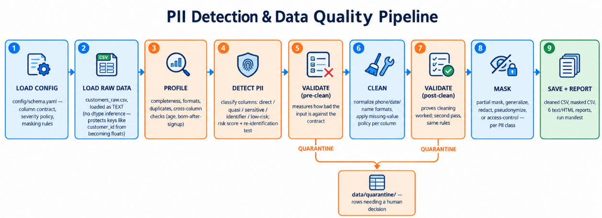

# PII Detection & Data Quality Validation Pipeline

Profiles a raw customer file, detects personal data, validates it against a
contract, cleans it, masks it, and reports on everything it did.

## Run it

```bash
pip install -r requirements.txt
export PII_PSEUDONYM_SALT="$(openssl rand -hex 32)"   # required for real extracts
python scripts/generate_raw_data.py     # synthetic messy input
python scripts/run_pipeline.py          # the whole thing
```

Exit codes: `0` ok · `1` input/config problem · `2` quality gate failed · `3` bug.

`scripts/run_pipeline.py` produces every required deliverable (all
`reports/*.txt` and `data/processed/*.csv`) in one run. There are no
separate per-stage scripts for cleaning/validation/masking/PII detection;
each stage is a module under `src/` (`src/profiling`, `src/pii`,
`src/transformations`), unit-tested on its own and orchestrated by
`src/pipelines/dq_pipeline.py`.

`scripts/run_profile.py` is a separate, optional EDA entry point: it writes
`reports/data_quality_report.txt` (same required Part 1 report) plus
`reports/standard_profile.html`, a generic `ydata-profiling` exploration
report. The HTML contains unmasked PII - never commit or share it.

## Pipeline order



```
Load (as text) → Profile → Detect PII → Validate (measure)
              → Clean → Validate (prove) → Mask → Save + Report
```

Validation runs twice on purpose: before cleaning to measure how bad the input
is, after cleaning to prove the cleaning worked.

## Outputs

| File | What it is |
|---|---|
| `reports/data_quality_report.txt` | profiling: completeness, formats, cross-column checks |
| `reports/pii_detection_report.txt` | which columns hold personal data, and the risk |
| `reports/validation_results.txt` | rule failures before and after cleaning |
| `reports/cleaning_log.txt` | every change made, with a reason |
| `reports/masked_sample.txt` | before/after evidence — **restricted, not committed** |
| `reports/pipeline_execution_report.txt` | run timeline, metrics, outputs |
| `reports/reflection.md` | written analysis |
| `reports/standard_profile.html` | generic EDA via ydata-profiling — **restricted, not committed** |
| `data/processed/customers_cleaned.csv` | cleaned, contract-compliant |
| `data/processed/customers_masked.csv` | pseudonymized extract for sharing |
| `data/quarantine/duplicate_keys.csv` | rows needing a human decision |
| `logs/manifest-<run_id>.json` | lineage: source, outputs, metrics, assumptions |

## Configuration

`config/schema.yaml` holds the column contract, severity policy, missing-value
strategy, masking rules and the ambiguous-date policy. Changing a rule is a
config edit, not a code change.


